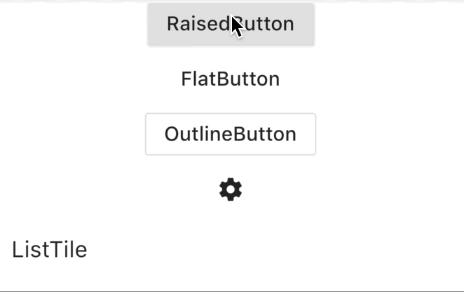
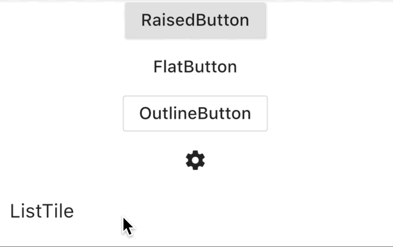
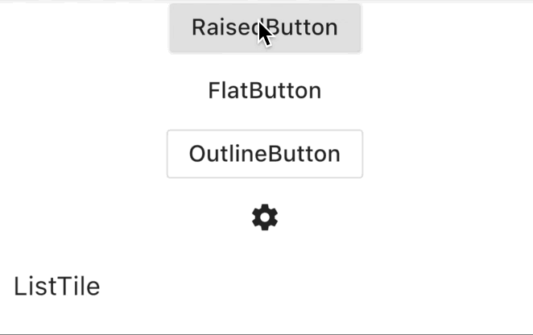
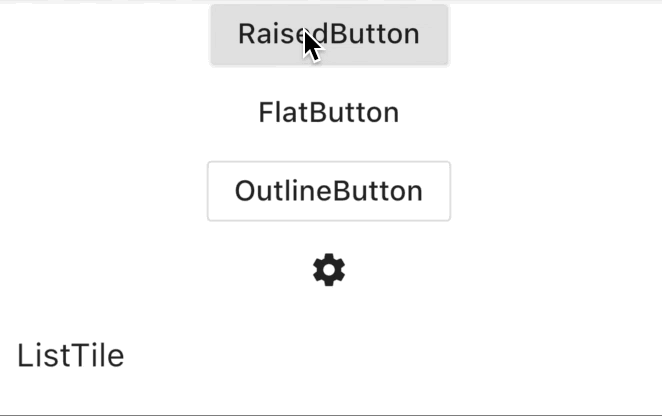

# Splash

[](https://pub.dartlang.org/packages/splash)
[](https://github.com/ueman/splash/actions?query=workflow%3Abuild)

This package contains a few alternatives for [InkSplash.splashFactory](https://api.flutter.dev/flutter/material/InkSplash/splashFactory-constant.html)
and [InkRipple.splashFactory](https://api.flutter.dev/flutter/material/InkRipple/splashFactory-constant.html).


## List of available splash alternatives

| Example                                           | Usage  |
|-                                                  |-      |
|        | `NoSplash.splashFactory` | 
|  | `LineSplash.splashFactory`, `LineSplash.customSplashFactory(paint: paint)` | 
|  | `PathSplash.splashFactory(path)`, `PathSplash.splashFactory(path, paint: paint, clip: false)` |
|  | `WaveSplash.splashFactory`, `WaveSplash.customSplashFactory(strokeWidth: 30, blurStrength: 5)` |

You can find an extensive example [here](example/lib/main.dart).


## How do I use them?

```dart
final splashFactory = ...

MaterialApp(
  theme: Theme(
    splashFactory: splashFactory,
  ),
  home: Scaffold(), 
);
```